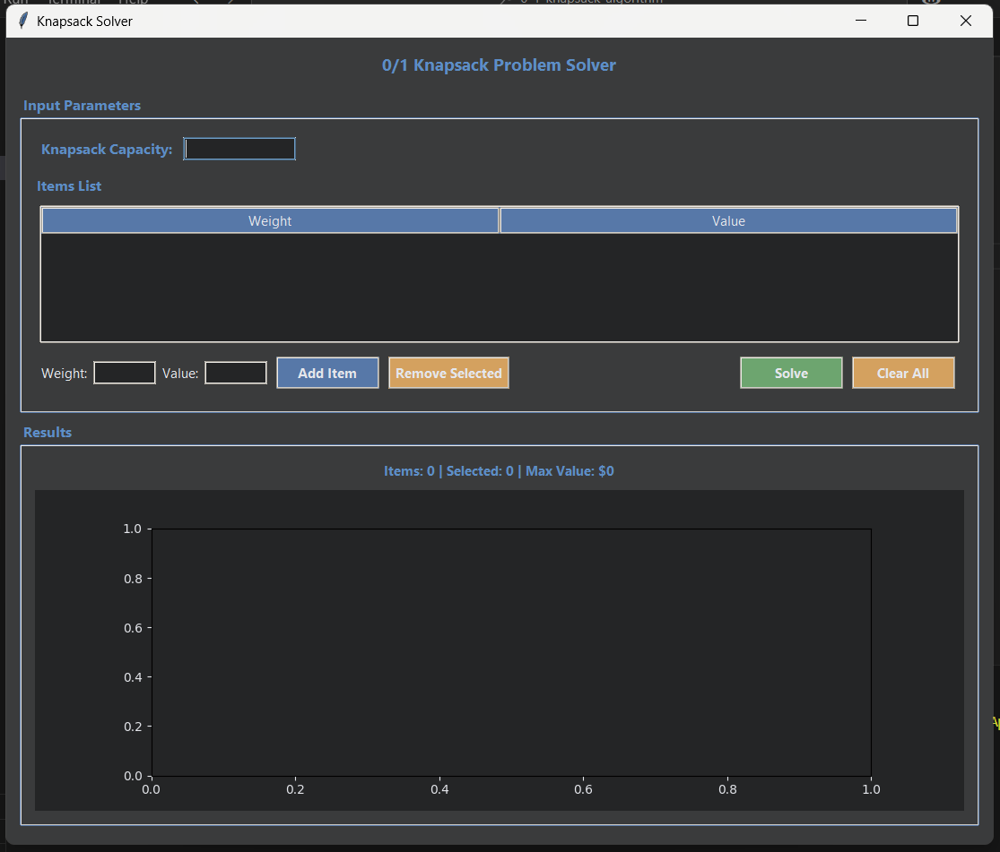
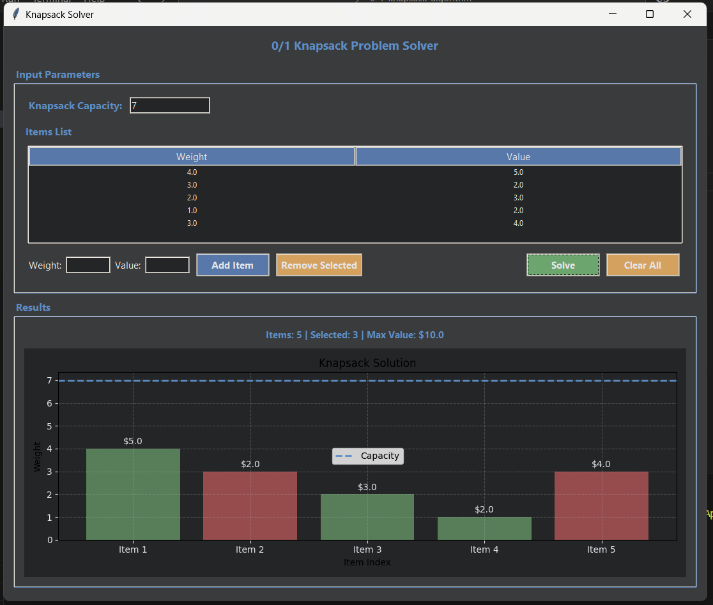

# 🎒 0/1 Knapsack Problem Solver (Python GUI)

An interactive application for solving the **0/1 Knapsack Problem** using **Dynamic Programming**, built with **Tkinter** for the user interface and **Matplotlib** for visualization.

---

## 📌 Project Overview

This project provides a visual and user-friendly way to understand how the 0/1 Knapsack Problem works. It allows users to input items (each with weight and value), set a knapsack capacity, and compute the optimal selection of items that maximizes value without exceeding the capacity.

The app is structured with modular components for better readability and separation of concerns:

- `algorithm.py`: Contains the dynamic programming implementation.
- `gui.py`: Manages all the GUI elements and user interactions.
- `styles.py`: Defines the theme colors and fonts used in the interface.
- `main.py`: Launches the app and connects the components.

---

## 🎯 Features

- Add and remove items dynamically
- Input custom weights and values
- Set knapsack capacity
- Visualize selected vs non-selected items in a bar chart
- Display maximum value achievable and items included in the optimal solution
- Dark-themed modern UI

---

## 📁 Folder Structure
┣ 📄 main.py

┣ 📄 algorithm.py

┣ 📄 gui.py

┣ 📄 styles.py

┣ 📄 README.md

## 🛠️ Built With

- Python
- Tkinter
- Matplotlib

---
## GUI example

## Problem and solution

